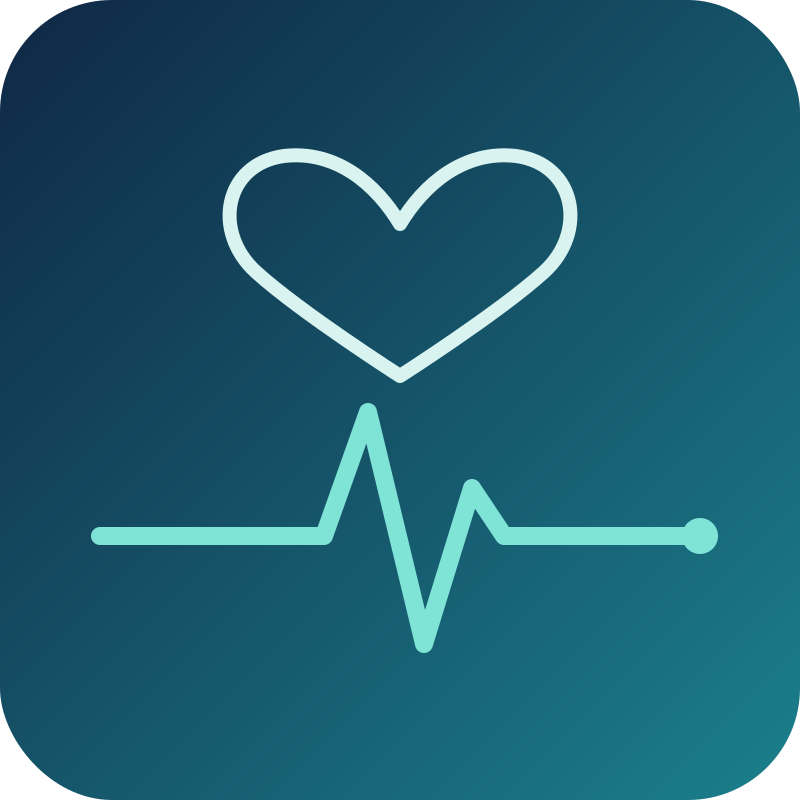

# Hi 👋, I'm Alessandro Cucchi

  

## 👨🏽‍🔬 Data Analyst for hire!

I'm a data analyst. I take raw numbers, work out what they really say, and explain them in plain language, helping turn data into insights that people can actually use.

- I'm drawn to questions where data can make a real difference
- I like digging into the details, finding patterns, and understanding what's behind the numbers
- I turn complex findings into clear, meaningful insights that are easy to communicate and act on
- Italian 🇮🇹 and English 🇬🇧

## 🚀 Featured project

<table>
  <tr>
    <td width="42%">
      
    </td>
    <td>
<h3>Fetal Health Analysis: spotting high-risk recordings early</h3>

<b>The question:</b> can a company that builds prenatal monitoring tools help clinics with limited resources spot the heart-rate recordings that need a closer look?

<b>What the analysis found:</b>

<ul>
  <li>Of the <b>35 high-risk cases</b> in the test set, <b>31 were correctly identified</b></li>

  <li><b>5 measurements out of 21</b> were enough to achieve similar results, suggesting that simpler and more affordable monitoring tools could be possible</li>

  <li>A rule that always answers "healthy" appears correct about 78% of the time but <b>finds no high-risk case at all</b>. For this reason, the analysis focused on detecting high-risk cases rather than overall accuracy</li>

  <li>The results were consistent across <b>5 different samples</b> of the data, supporting the robustness of the approach</li>
</ul>

<b>Handle with care:</b> the test sample is relatively small.

  
      
      
        
      <a href="https://github.com/YOUR-USERNAME/fetal-health-classification"><b>Go to project →</b></a>
    </td>
  </tr>
</table>

More projects coming soon.

## 🛠️ Tools

## 🤝 Let's connect

